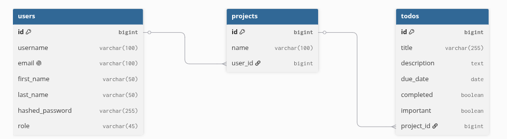
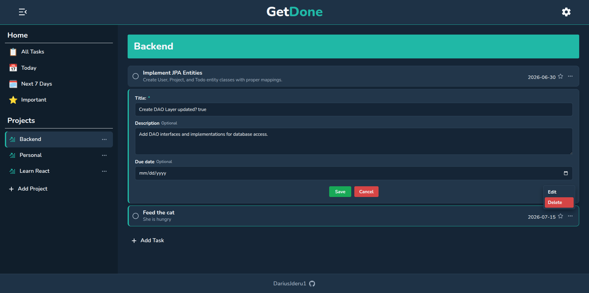
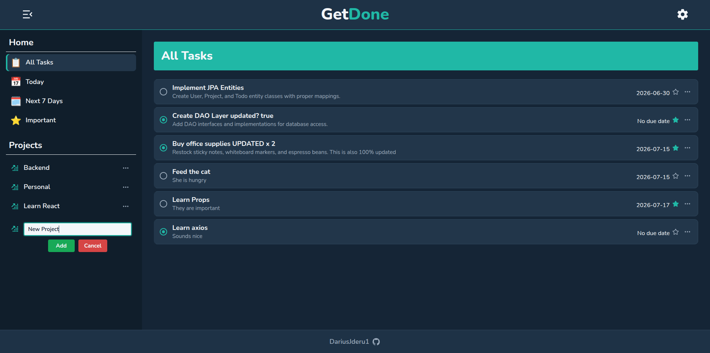
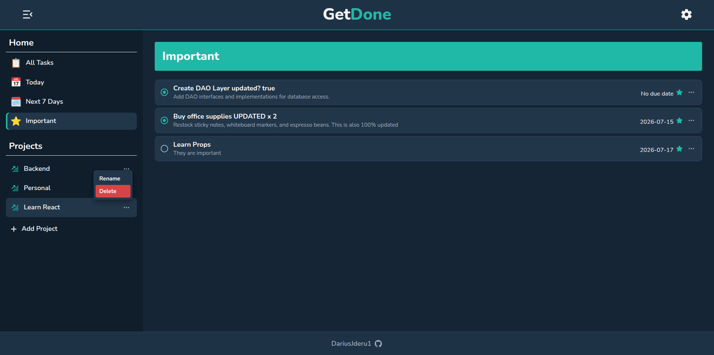
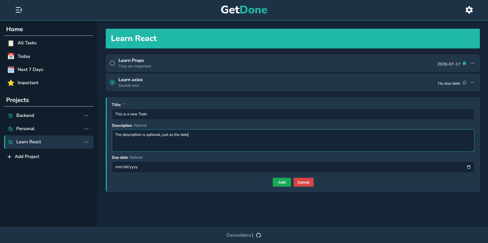

# GetDone

GetDone is a full-stack task management application built with React, Spring Boot, and MySQL. It lets users organize tasks into projects, update their status, mark important tasks, and browse task lists based on due date or project.

The project was built to practice connecting a React frontend to a REST API and organizing a Java backend into controllers, services, DAOs, DTOs, mappers, and exception handlers.

## Features

- Create, rename, and delete projects.
- Create, edit, and delete tasks inside a project.
- Add an optional description and due date to a task.
- Mark tasks as completed or incomplete.
- Mark tasks as important.
- View all tasks or filter them by today, the next seven days, importance, or project.
- Keep the interface updated after create, update, and delete operations without reloading the page.
- Use the application on both desktop and smaller screens through a responsive sidebar and layout.
- Display loading states, API errors, empty lists, and invalid project routes.

## Tech Stack

- **Frontend:** React 19, React Router, Vite, CSS Modules, Material UI, React Icons
- **Backend:** Java 25, Spring Boot 4.1, Spring Web MVC, JPA/Hibernate, Maven
- **Database:** MySQL

## Backend Structure

The backend follows a layered structure:

**Request → REST Controller → Service → DAO → MySQL**

- **REST Controllers** define the API endpoints, validate incoming data, and handle requests.
- **DTOs** define the request and response data without exposing the entities directly.
- **Mappers** convert entities into response DTOs.
- **Services** connect the controllers to the persistence layer.
- **DAOs** handle database operations using JPA and Hibernate.
- **Entities** map Java objects to the MySQL tables.
- **Exception handling** returns consistent API error responses.

## Database Schema

The database uses three tables. A user can own multiple projects, and each project can contain multiple todos. Deleting a user removes their projects, while deleting a project also removes its todos.

## Roadmap

The next major step is adding authentication and authorization with Spring Security. The application currently works with a demo user, and project creation still sends a fixed user ID from the frontend.

The planned security work includes:

- Add user registration and login.
- Store passwords as secure hashes instead of plain text.
- Use the authenticated user instead of a hardcoded user ID.
- Make sure users can only access and modify their own projects and tasks.
- Protect API endpoints and return appropriate responses for unauthenticated or unauthorized requests.
- Use the existing user role field as the starting point for role-based authorization.

## Screenshots

<table>
    <tr>
        <td width="50%">
            <strong>Editing a task</strong> 
            
        </td>
        <td width="50%">
            <strong>All tasks and project creation</strong> 
            
        </td>
    </tr>
    <tr>
        <td width="50%">
            <strong>Important tasks and project actions</strong> 
            
        </td>
        <td width="50%">
            <strong>Creating a task</strong> 
            
        </td>
    </tr>
</table>
